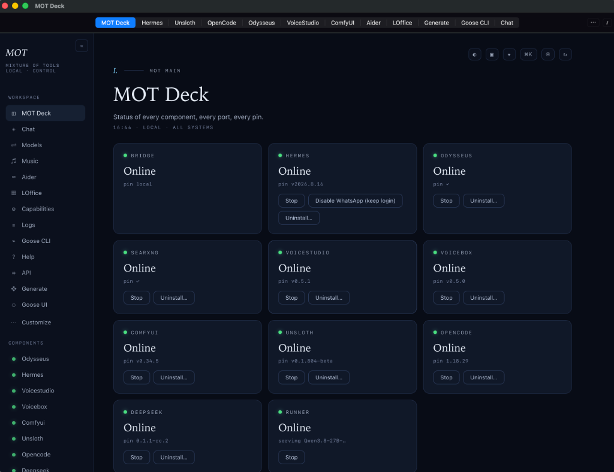

# MOT Deck (Mixture of Tools)

> **Local-First AI Workspace & Orchestrator for macOS**

<p align="center">
  
</p>

MOT Deck is a native macOS application and local orchestration stack that merges state-of-the-art local agent runtimes, LLM engines, and creative workflows into a unified, privacy-preserving desktop experience. Built specifically for Apple Silicon—no Docker required.

---

## Key Features

- **Unified Mission Control**: Manage local model servers, agents, and creative runtimes through an integrated macOS desktop panel.
- **Hardware-Aware Local Inference**: Native execution via `llama.cpp` (GGUF) and Apple MLX with real-time memory budgeting and fit calculation.
- **Pluggable Agent Runtimes**: Out-of-the-box integration for Hermes Agent, Odysseus, OpenCode, and Goose.
- **Integrated Creativity & Productivity**:
  - **Document AI**: ONLYOFFICE integration with embedded AI assistant plugin for `.docx`, `.xlsx`, and `.pptx`.
  - **Visual Generation**: ComfyUI tab integration with hardware-aware offloading.
  - **Audio & Music**: Voice synthesis (VoiceStudio, Voicebox) and music generation.
  - **Private Search**: Local SearXNG instance for air-gapped web research.
- **Hermes Path Guard**: Dedicated filesystem safety sandbox fencing agent tool execution behind interactive human approvals.

---

## Prerequisites

- **macOS**: Apple Silicon (M1, M2, M3, M4 or later) running macOS 14+.
- **Command Line Tools**: Installed via `xcode-select --install`.
- **Python**: Python 3.11 or newer.
- **Homebrew** (optional, recommended for auxiliary system tools).

---

## Quick Start

### 1. Clone the Repository
```bash
git clone https://github.com/deb-dan/M.o.T-Deck.git
cd M.o.T-Deck
git submodule update --init --recursive
```

### 2. Bootstrap Dependencies
Run the interactive bootstrap script to prepare Python environments and dependencies:
```bash
./scripts/bootstrap.sh
```

### 3. Start MOT Deck
Launch the local bridge daemon:
```bash
./scripts/start.sh
```
The Mission Control panel will be available at [http://127.0.0.1:8700](http://127.0.0.1:8700).

### 4. Build the Native macOS App (Optional)
To compile the native standalone `MOT Deck.app` bundle:
```bash
./scripts/build_app.sh
```
Or to build the full offline distributable disk image:
```bash
./scripts/build_app.sh --fat
```

---

## Repository Structure

```
├── app/          # Native macOS Swift shell (menu bar, window manager, lifecycle)
├── bridge/       # Python bridge daemon (HTTP/WebSocket API, process supervisors)
│   ├── core/     # App context, fit advisor, lifecycle supervision
│   ├── panel/    # Mission Control frontend (HTML/CSS/JS)
│   └── tests/    # Test suites and contract verification
├── guards/       # Hermes Path Guard security plugin
├── policies/     # Command approvals and routing policies
├── scripts/      # Bootstrap, install, health check, and build tooling
├── skills/       # Versioned agent skills
├── motdeck.yaml  # Component manifest, pins, ports, and configuration
├── VERSION       # Active release version tag
└── LICENSE       # GNU AGPL-3.0 License
```

---

## Architecture & Design Principles

1. **Local-First & Private**: All inference, database stores, and agent turns run on local loopback (`127.0.0.1`). No telemetry or unsolicited outbound phone-homes.
2. **Arm's-Length Orchestration**: Third-party runtimes operate as isolated background services communicating via documented HTTP/IPC boundaries.
3. **Fail-Closed Security**: Dangerous shell executions and out-of-workspace writes are intercepted and require explicit user authorization.

---

## License

This project is licensed under the **GNU Affero General Public License v3.0 (AGPL-3.0)**. See the [LICENSE](LICENSE) file for details.

### Third-Party Software Notices
MOT Deck interfaces with and orchestrates various independent third-party runtimes and libraries (including ComfyUI, SearXNG, Goose, OpenCode, llama.cpp, Apple MLX, and ONLYOFFICE). Each third-party component is governed by its respective upstream license.
